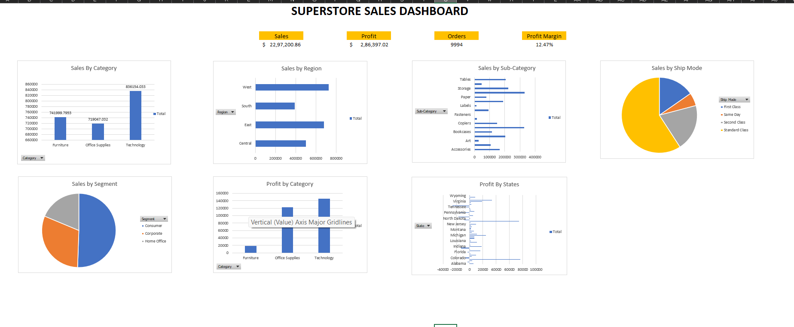

# 📊 Superstore Sales Dashboard (Excel)

## 📌 Project Overview

This project is an interactive Excel Sales Dashboard created using the Superstore dataset. The dashboard provides insights into sales performance, profit, customer segments, product categories, regions, and shipping modes using Pivot Tables, Pivot Charts, KPIs, and Slicers.

---

## 🛠️ Tools Used

- Microsoft Excel
- Pivot Tables
- Pivot Charts
- Slicers
- KPI Metrics
- Excel Formulas

---

## 📈 KPI Metrics

- Total Sales
- Total Profit
- Total Orders
- Profit Margin
- Average Discount

---

## 📊 Dashboard Features

- Sales by Category
- Sales by Region
- Sales by Segment
- Sales by Sub-Category
- Profit by Category
- Profit by State
- Sales by Ship Mode

---

## 🎯 Interactive Features

- Region Slicer
- Category Slicer
- Segment Slicer
- Ship Mode Slicer

These slicers allow users to dynamically filter the dashboard and analyze sales performance.

---

## 📷 Dashboard Preview

---

## 📂 Project Files

- Superstore_Sales_Dashboard.xlsx
- Dashboard.png

---

## 🚀 Skills Demonstrated

- Data Cleaning
- KPI Design
- Pivot Table Analysis
- Data Visualization
- Dashboard Development
- Business Reporting
